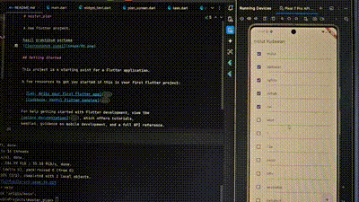
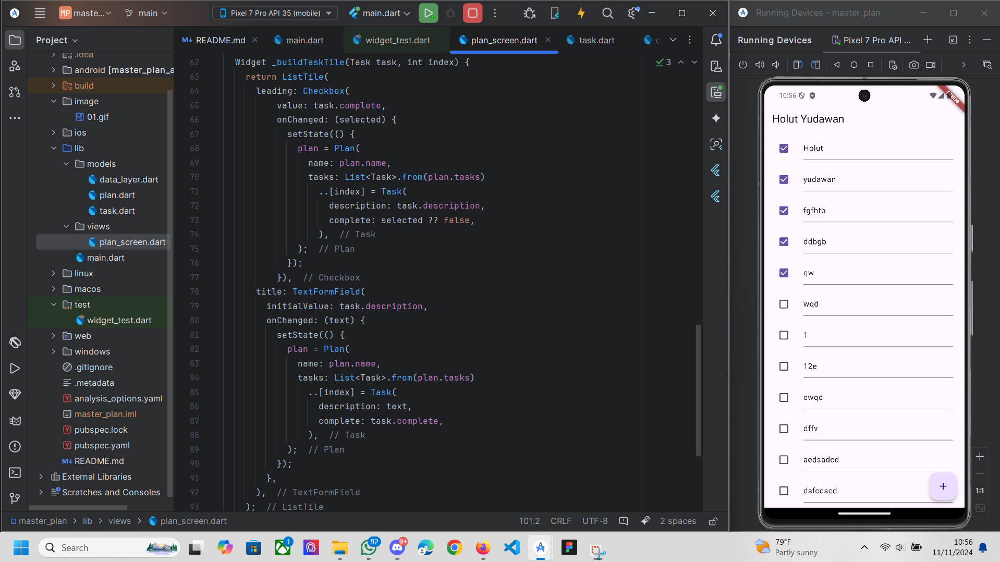

# master_plan

A new Flutter project.

hasil praktikum pertama

2. mengelompokkan semua model data yang digunakan dalam aplikasi ke dalam satu berkas data_layer.dart
daripda mengimportnya secara terpisah.
3. digunakan untuk menyimpan objek Plan yang berisi daftar tugas (tasks) dan nama rencana,
Plan dibuat sebagai konstanta agar tugas-tugasnya dapat tetap terjaga dan tidak secara langsung diubah tanpa melalui pengaturan ulang di setState

4. ListTile digunakan untuk menampilkan setiap tugas (task) dalam daftar tugas yang ada di plan.
ListTile ini memungkinkan pengguna untuk mengedit deskripsi tugas melalui TextFormField

5. Pada langkah 11 initState digunakan untuk menginisialisasi ScrollController dan menambahkan listener yang menutup keyboard ketika pengguna melakukan scroll.
   Pada langkah 13, dispose dipakai untuk membersihkan ScrollController ketika widget tidak lagi digunakan (misalnya ketika layar berubah).
   praktikum ke-9

## Getting Started

This project is a starting point for a Flutter application.

A few resources to get you started if this is your first Flutter project:

- [Lab: Write your first Flutter app](https://docs.flutter.dev/get-started/codelab)
- [Cookbook: Useful Flutter samples](https://docs.flutter.dev/cookbook)

For help getting started with Flutter development, view the
[online documentation](https://docs.flutter.dev/), which offers tutorials,
samples, guidance on mobile development, and a full API reference.
